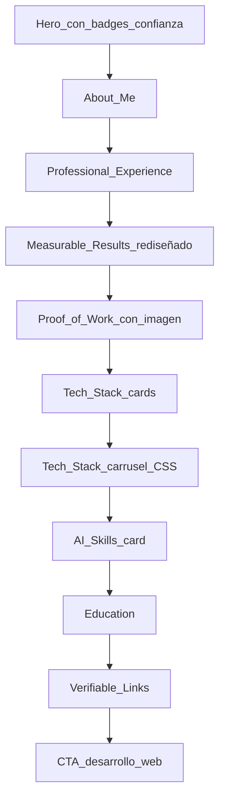

# Mejora de /jvportafolio (solo esta página)

## Alcance estricto

Solo se modificarán estos archivos:

| Archivo | Cambio |
|---------|--------|
| [`src/content/jvPortfolio.js`](src/content/jvPortfolio.js) | Todo el copy EN/ES, estructura de datos nueva |
| [`src/pages/JvPortfolio.jsx`](src/pages/JvPortfolio.jsx) | Layout visual, nuevas secciones, imports |
| [`src/pages/JvPortfolio.css`](src/pages/JvPortfolio.css) | **Nuevo** — estilos con prefijo `jv-`, importado solo desde `JvPortfolio.jsx` |
| [`app/routes/jv-portfolio.jsx`](app/routes/jv-portfolio.jsx) | JSON-LD y meta derivados del contenido |

**No se toca:** `index.css`, `App.css`, Navbar, Footer, chatbot, otras rutas/páginas, `package.json`.

**Ruta CTA principal:** `getLocalizedPath('svc-web', locale)` → `/services/web-development` (EN) / `/es/servicios/desarrollo-web` (ES).

**Imagen local disponible:** solo [`src/assets/mejorasseoindicadores.webp`](src/assets/mejorasseoindicadores.webp) (no hay carpeta con más archivos). Se usará en una sección "Proof of Work" / "Performance & SEO Improvements" con diseño de mockup card.

---

## 1. Contenido (`jvPortfolio.js`)

### Experiencia: 4+ → 5+
Actualizar en: `meta.description`, `hero.badges.experience`, About, y cualquier mención restante (EN: `"5+ years of experience"` / ES: `"Más de 5 años de experiencia"`).

### About Me (reescritura EN + ES equivalente)

**Párrafo 1** — base del usuario, pulida:
> I'm an Electronics Engineer, Front-End Web Developer and Technical SEO Specialist with 5+ years of experience building fast, accessible and search-optimized websites. I founded Webraf to combine development, technical SEO, analytics and AI-assisted workflows into practical digital solutions for businesses.

**Párrafo 2** — agencia genérica, +100 clientes, sin nombre:
> In my agency work, I supported more than 100 client projects, handling technical and on-page SEO audits, Core Web Vitals improvements, front-end fixes, CMS optimizations and security recovery for compromised websites.

**Párrafo 3** — cierre humano, sin clichés de plantilla:
> I combine development, data and AI to build solutions you can measure — not just launch and forget.

### Experience: anonimizar WebSell
- `company`: `"Web Development Agency"` / `"Agencia de desarrollo web"`
- Bullets: quitar **PHP**; reforzar WordPress, SEO, Core Web Vitals, seguridad
- Rol independiente: mantener WordPress; sin PHP

### Measurable Results
- `"Top 2 on Google"` → `"Top 1 on Google"` / `"Top 1 en Google"`
- Label: *"Multiple client sites reached #1 positions on Google for target searches through technical SEO, on-page optimization and performance improvements."*
- Mantener 90+ PageSpeed, +300%, −25%

### Tech Stack — nueva estructura de datos
Reemplazar `stack.items: string[]` por objetos:

```js
{ name: 'WordPress', category: 'CMS Specialist', highlight: true }
```

Lista final (**sin PHP**, con WordPress destacado):
HTML5, CSS3, JavaScript, React, Node.js, Bootstrap, **WordPress Specialist**, Power BI, Git, GitHub, VS Code, API Integration, Technical SEO, Core Web Vitals, AI Workflows

### AI Skills — bloque dedicado
Nueva clave `aiSkills` con heading + descripción compacta:
> AI-assisted development workflows with ChatGPT, Claude, Gemini, Cursor, Codex CLI, Gemini CLI and Antigravity, including terminal-based coding, debugging, documentation and automation support.

Presentado como card técnica (no lista inflada de 12 bullets).

### Proof of Work — nueva sección
Nueva clave `proofOfWork`:
- Heading: `"Proof of Work"` / `"Trabajo comprobable"`
- Subtitle explicando evidencia real de SEO/rendimiento
- Array de imágenes con `src`, `alt`, `caption` (1 item por ahora con `mejorasseoindicadores.webp`)

### CTA final
- Heading: `"Want me to build or improve your website?"`
- Text: `"Explore Webraf's web development services or contact me directly to discuss your project."`
- Botón principal: `"See Web Development Services"` → `svc-web`
- Secundario: `"Contact me"` (sin cambio de ruta)

---

## 2. UI y diseño (`JvPortfolio.jsx` + `JvPortfolio.css`)

### Arquitectura de secciones (orden final)



### Hero
- Mantener foto y links existentes
- Añadir micro-badges de confianza bajo el tagline: `"5+ years"`, `"100+ client projects"`, `"WordPress Specialist"` (texto desde content)
- Sutil fondo técnico: grid CSS + glow suave vía clase `jv-hero-bg`

### Measurable Results — cards mejoradas
- Icono lucide por card (`TrendingUp`, `Gauge`, `BarChart3`, `ShieldCheck`)
- Valor grande en cyan, label debajo, borde accent al hover
- Grid responsive `repeat(auto-fit, minmax(240px, 1fr))`

### Proof of Work
- Import: `import seoProofImg from '../assets/mejorasseoindicadores.webp'`
- Card mockup: marco con borde, sombra, caption debajo
- `` con dimensiones controladas (`max-width: 100%`, `object-fit: contain`)
- Si en el futuro hay más imágenes, el array en content escala sin cambiar estructura

### Tech Stack — cards visuales
- Grid de cards: icono SVG inline (mapa `techIcons[name]` en el mismo archivo), nombre, categoría
- WordPress card con clase `jv-tech-card--highlight` (borde accent, badge "CMS Specialist")
- Iconos: SVG inline minimalistas por tecnología (sin librerías nuevas); lucide solo para iconos genéricos (Code, Database, etc.) donde no haya marca

### Tech Stack — carrusel CSS (sin JS, sin deps)
En `JvPortfolio.css`:

```css
@keyframes jv-marquee { /* translateX loop */ }
.jv-marquee-track { animation: jv-marquee 40s linear infinite; }
.jv-marquee:hover .jv-marquee-track { animation-play-state: paused; }
@media (prefers-reduced-motion: reduce) {
  .jv-marquee-track { animation: none; overflow-x: auto; }
}
```

- Track con items duplicados (`[...items, ...items]`) para loop seamless
- Badges compactos (nombre + categoría mini)
- `overflow: hidden` en desktop; scroll horizontal nativo en reduced-motion

### AI Skills
- Card ancha con icono `Bot` (lucide) + texto del bloque `aiSkills`
- Chips secundarios opcionales: Cursor, Codex CLI, Gemini CLI, Antigravity (máx. 4 chips, no lista exhaustiva)

### Estilo general anti-plantilla
- Prefijo `jv-` en todas las clases nuevas
- Secciones alternas con `var(--bg-secondary)` (patrón actual)
- Separadores decorativos: línea gradiente `jv-section-divider`
- Cards con `transition` suave en border/box-shadow
- Mantener tokens existentes (`--accent-cyan`, `--bg-card`, `.btn`, `.container`, `.section`)

### Performance y accesibilidad
- Solo la foto del hero con `fetchPriority="high"`; resto `loading="lazy"`
- Carrusel decorativo: `aria-hidden="true"` en el track animado; contenido real en grid estático (accesible)
- Contraste y focus visible heredado de estilos globales `.btn`
- Sin `useEffect` ni listeners JS para animaciones

---

## 3. E-E-A-T / SEO (`jv-portfolio.jsx`)

Actualizar `personSchema`:
- `jobTitle`: incluir WordPress — ej. `"Front-End Developer, WordPress Specialist & Technical SEO Specialist"`
- `knowsAbout`: añadir `WordPress`, `AI-assisted Development`, `Prompt Engineering`; quitar referencias a PHP si existieran
- `description` (opcional en schema): mención de 5+ años

Meta `description` ya se toma de `jvContent[locale].meta.description` tras el update de contenido.

---

## 4. Verificación manual post-cambio

- `/jvportafolio` y `/es/jvportafolio` en dev server (ya activo)
- Responsive: 375px / 768px / 1280px
- Hover pause del carrusel
- `prefers-reduced-motion` (DevTools emulation)
- CTA principal lleva a Web Development, no SEO
- Confirmar que Home, Services, Blog, etc. no cambian (diff acotado a 4 archivos)
- Lighthouse: sin JS extra, imágenes lazy, una sola imagen nueva en bundle de esta página
